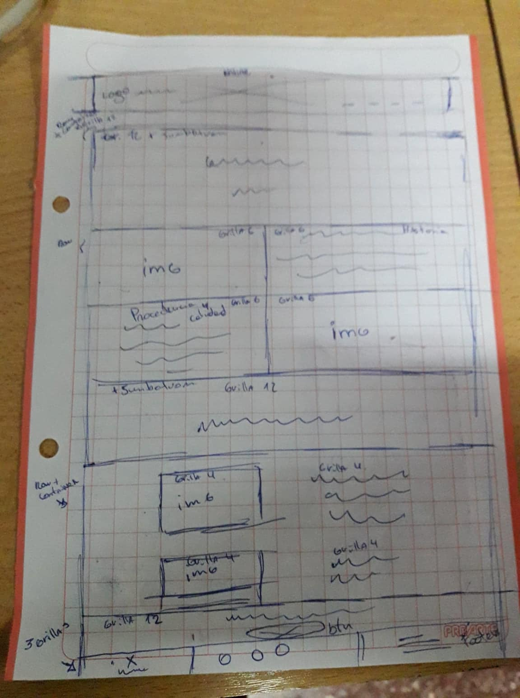
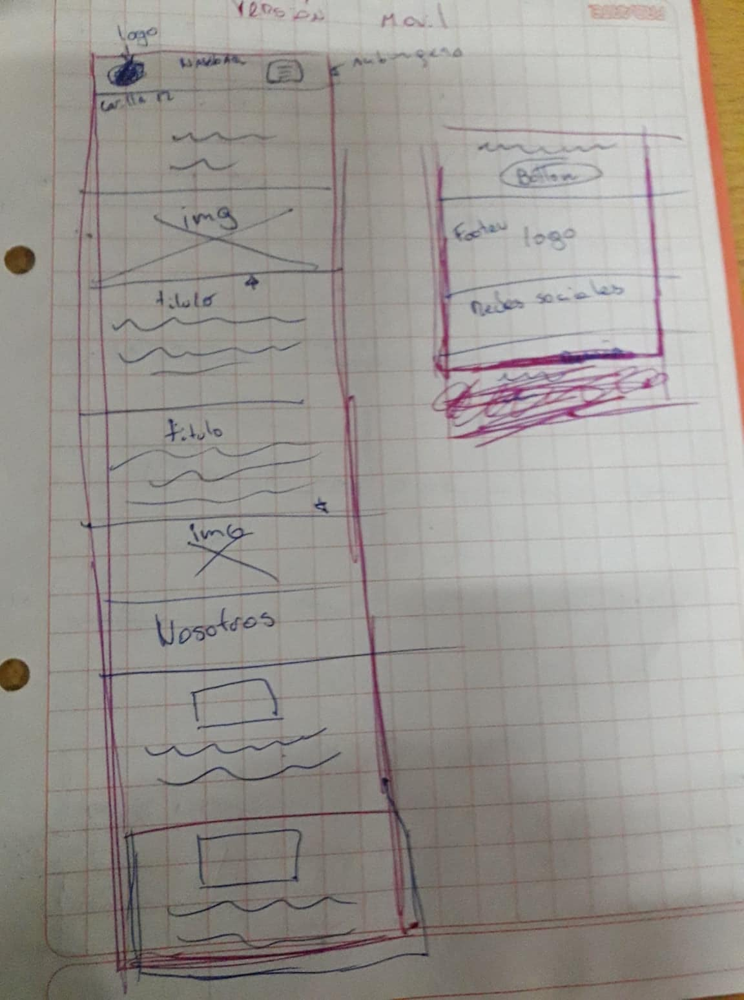

# Maqueta sitio web TiaTomate

## pre-maquetado

se crea una maqueta comenzando por un navbar
que contenga logo y los siguientes 4 links 

- acerca de..
- productos
- blog
- contacto

la pag contendrá 5 secciones

- encabezado.
- historia de la empresa.
- procedencia del producto y calidad para crear un interés aun mayor en el producto que se ofrece.
- Nosotros donde se habla de la pasión de nuestra empresa para nuestros productos y su trabajo.
- se ofrece servicio y se invita a realizar la compra a través de un link.

ademas contiene un footer donde se encuentran logo ,las redes sociales de la empresa y nuevamente muestra el blog y mas productos.

Su navbar mantendrá logo y tendrá una hamburguesa con las mismas opciones de la versión escritorio.

la versión móvil va a contener las mismas secciones
donde el nosotros sera mas breve.

el footer mantendrá el logo y redes sociales.

## maquetación

- se crea archivo index.html y carpeta assets donde se encuentra la hoja de estilo propio, img y fonts.
- se da estructura a index.html usando navbar, Jumbotron y sistema de grillas 
 de Bootstrap.

